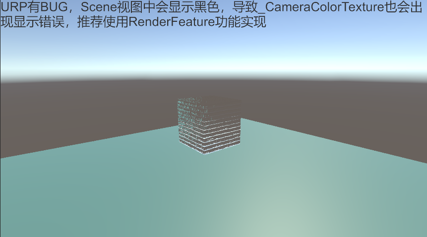
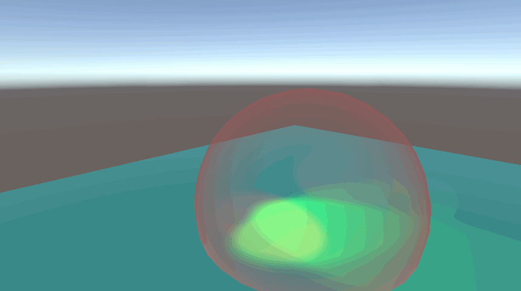
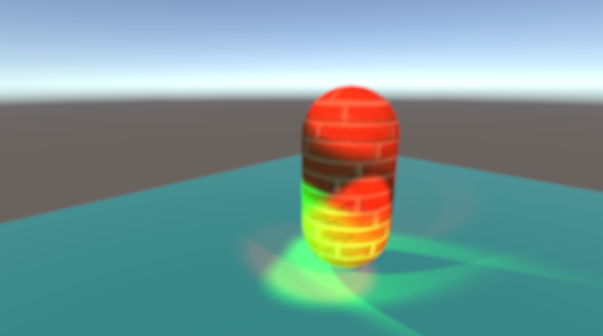
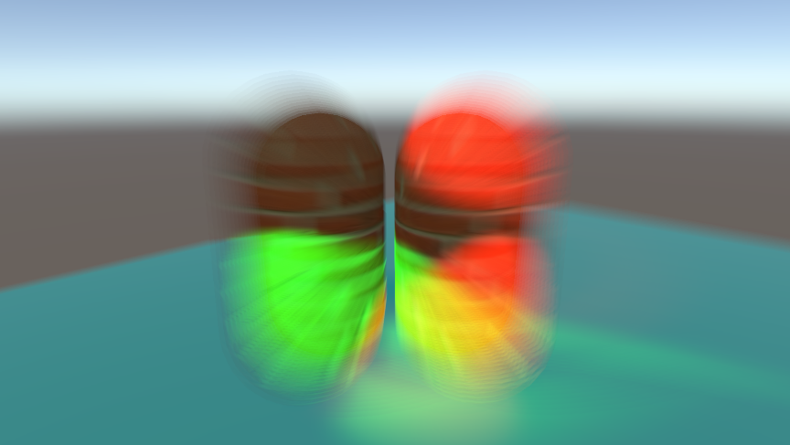
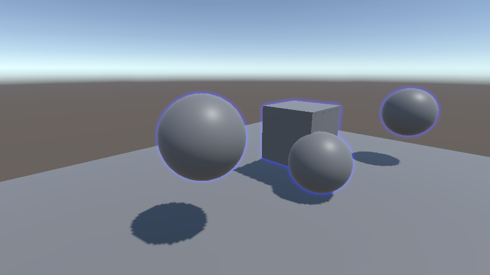
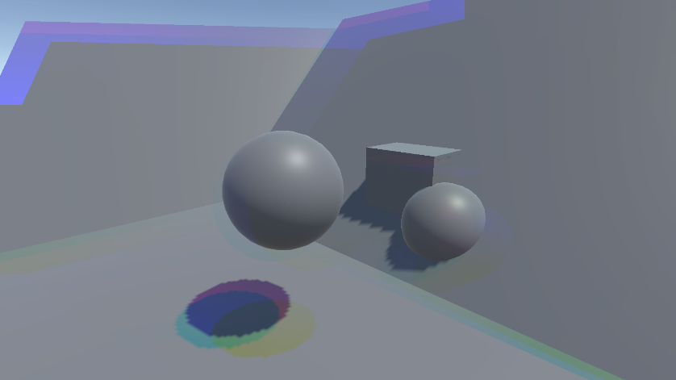
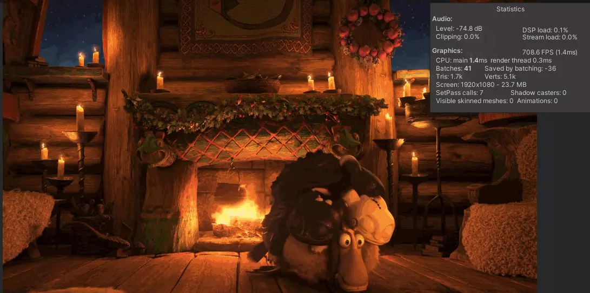
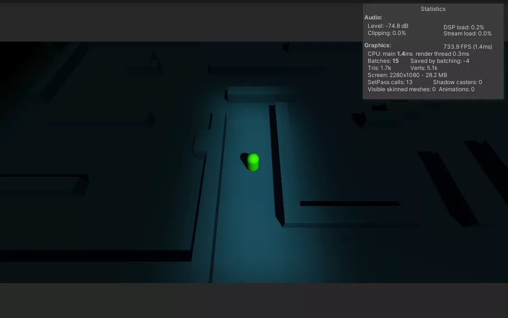

# URP_Practise
URP个人练习项目，参考多处文章和博客，部分效果可能由于大小问题导致不在此仓库中，但是给出了网址链接，其中包含项目链接。

## 包含效果
### [多光源多阴影](https://github.com/wqaetly/URP_Practise/tree/main/Assets/Samples/MultipleLightAndShadow)

### [基于法线贴图的玻璃效果](https://github.com/wqaetly/URP_Practise/tree/main/Assets/Samples/GlassBasedOnNormalMap)

### [基于深度贴图的能量罩效果](https://github.com/wqaetly/URP_Practise/tree/main/Assets/Samples/EngryBasedOnDepthMap)

### [Kawase模糊](https://github.com/wqaetly/URP_Practise/tree/main/Assets/Samples/KawaseBlur)

### [双重Kawase模糊](https://github.com/wqaetly/URP_Practise/tree/main/Assets/Samples/DualKawaseBlur)

### [径向模糊](https://github.com/wqaetly/URP_Practise/tree/main/Assets/Samples/RadialBlur)

### [扫描效果](https://github.com/wqaetly/URP_Practise/tree/main/Assets/Samples/Scan)

### [描边效果](https://github.com/wqaetly/URP_Practise/tree/main/Assets/Samples/Outline)

### [颜色分离效果](https://github.com/wqaetly/URP_Practise/tree/main/Assets/Samples/RGBSeparate)

### [基于后处理的热空气扭曲效果](https://github.com/wqaetly/URP_Practise/tree/main/Assets/Samples/Air-distortion)

### [基于屏幕空间采样的战争迷雾](https://www.lfzxb.top/fog-of-war-based-on-ss-in-urp/)

## 引用文章
 - [URP下基于屏幕空间采样的战争迷雾](https://www.lfzxb.top/fog-of-war-based-on-ss-in-urp/)
 - [URP下基于后处理的热空气扭曲效果](https://www.lfzxb.top/air-distortion-based-on-pp-in-urp/)
 - [B站天守魂座_雪风: urp管线的自学hlsl之路](https://www.bilibili.com/read/cv6382907)
 - [高品质后处理：十种图像模糊算法的总结与实现](https://zhuanlan.zhihu.com/p/125744132)
 - [高品质后处理：十种故障艺术(Glitch Art)算法的总结与实现](https://zhuanlan.zhihu.com/p/148256756)
 - [Unity实现地图扫描效果](https://zhuanlan.zhihu.com/p/143788955)